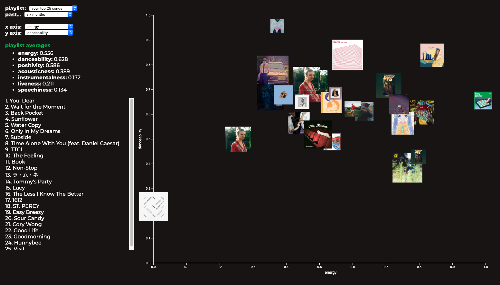

## [interactive-spotify](https://interactive-spotify.herokuapp.com)

an interactive visualization of your most liked spotify songs, or any playlist in your library. uses the [spotify api](https://developer.spotify.com/documentation/web-api/). a spotify account is required for access.

### developer

- joonho ko (joonhok@mit.edu)

### development process -- commentary

development was done slowly and incrementally, and was done after a thorough exploration of the spotify API and what it was capable of. before exploring the API, i had no idea what kind of visualization the final project would turn out to be, since i did not know what data there was to visualize in the first place. the audio features data stood out to me as something sufficiently interesting to try to visualize that not many people had tried to visualize before.

after creating a static, non-interactive visualization of just one collection of songs -- namely the top 25 songs -- i deployed the web app to heroku and asked my friends to 'playtest' and give suggestions. from there, and after reading peer reviews from class, i added customizability and interactive elements such as changing the axes, changing playlists, hover interactability, and playing the song you're hovering automatically. being a one-person team, i didn't get to complete all the features i wanted to in time, but i hope to come back to this project at a later time and flesh it out more.

### run locally

interactive-spotify is currently deployed [here](https://interactive-spotify.herokuapp.com). if you would like to add new features or develop on top of this project locally:

1. clone and cd into this repository.
2. `npm install`
3. you need the `client_secret` variable in `app.js` -- ask the developer for access.
4. `node app.js` 
5. open the app in your browser on `localhost:8888`.
